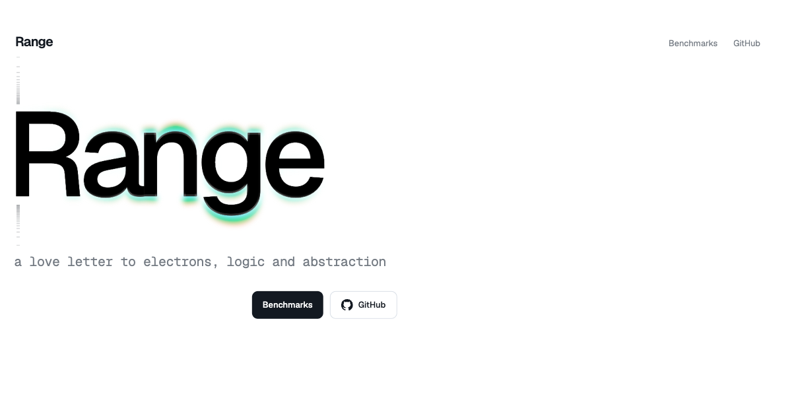

<div align="center">

<a href="https://rangelang.org">
  
</a>

### An applied programming language

[Website](https://rangelang.org) · [Intro to Range](https://rangelang.org/posts/intro-to-range) · [Benchmarks](https://rangelang.org/benchmarks)

</div>

Range is a native programming language for describing software as a typed
graph. Instead of recovering meaning from syntax and then scattering it across
separate compiler representations, Range keeps identity, value, access,
ownership, and transformation connected in one program model.

It is a language about the architecture of a program as much as its execution:
what a value is, which identity it belongs to, how it may be reached, and what
is allowed to transform it.

## Identity : Value

Range begins with one base concept: **Identity : Value**. It is the smallest
unit of meaning in the graph. Lowering may represent identity and value
separately, but the language does not confuse a value with the question of
*which* value it is.

That distinction lets Range describe mutation, sharing, ownership, and
specialization as relationships in the graph rather than conventions layered
on top of it.

## A small concrete language

The concrete substrate is intentionally compact:

- `construct` describes composed values.
- `enum` describes alternatives.
- `function` describes behavior between them.

Properties state their storage and access relationship directly. `let` is
immutable storage, `state` is mutable storage, `binding` is projected access,
and `derived` is computed access.

```range
construct Counter {
    let seed: Int
    state count: Int

    derived total: Int {
        seed + count
    }
}

function clamp(value: Int, min: Int, max: Int): Int {
    if value < min { return min }
    if value > max { return max }
    return value
}
```

The goal is not to introduce a new kind for every programming pattern. Range
builds richer ideas by composing a few explicit forms.

## The language can see itself

Macros begin where the concrete vocabulary ends. A Range macro receives typed
program structure, queries the environment it has authority to observe, and
returns a transformed execution graph. Macros therefore work with declarations,
members, identities, and relationships—not an untyped token stream hidden from
the rest of the language.

This makes metaprogramming part of the same model as ordinary programming. The
long-term aim is a language whose frameworks, compiler, editor intelligence,
and program transformations all speak about the same graph.

## Written in Range

The supported compiler is authored in Range and emits native LLVM. Compiler
changes are accepted only at a reproducible fixed point: the accepted compiler
builds a candidate, and that candidate rebuilds the same source into
byte-identical LLVM and a byte-identical executable.

There is one rolling compiler authority under `RangeCompiler/Bootstrap/`. Old
compilers remain history, not competing sources of truth.

## Where Range is today

Range is early, self-hosting language infrastructure under active development.
Its compiler already parses and reasons about real Range programs, executes
typed macros, models ownership and graph relationships, and emits native code.
Its supported language surface is still deliberately bounded, and focused
fixtures prove individual capabilities rather than claiming a complete
language or standard library.

The [milestones](MILESTONES.md) describe the path from the current compiler
kernel to a broadly usable language. Performance work and reproducible
comparisons live in the dedicated [benchmark suite](Benchmarks/Speed/README.md)
and on the [benchmark site](https://rangelang.org/benchmarks).

## Explore Range

Compile a focused program to LLVM:

```sh
scripts/range compile Testing/Basics/Pass/ReturnInteger.range
```

Build and run a Range program:

```sh
range run path/to/Program
```

Inspect the current compiler build plan or prove a compiler checkpoint:

```sh
scripts/range check-build-plan
scripts/range check-compiler-candidate
```

The ordinary file and directory wrappers bundle the canonical Core sources
through the accepted compiler. `range run` additionally links the
manifest-declared runtime inputs and executes `@main`.

## License

Copyright 2026 Giorgi Tchelidze.

Range is licensed under the [Apache License, Version 2.0](LICENSE).

## Trademarks

The Range name and logo are trademarks of Giorgi Tchelidze. The Apache License
does not grant permission to use these marks except as required for reasonable
and customary use in describing the origin of the software.
